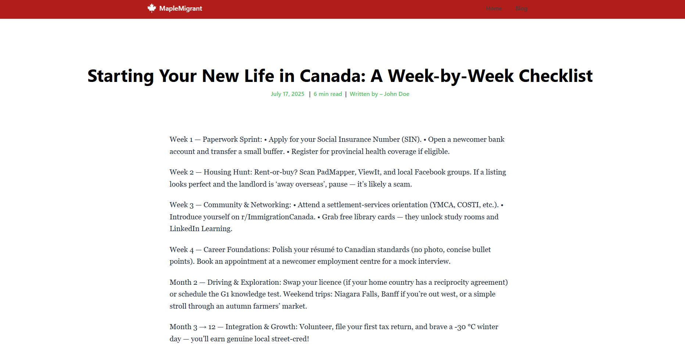
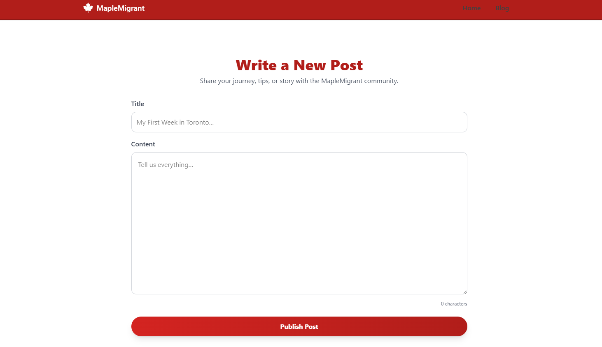
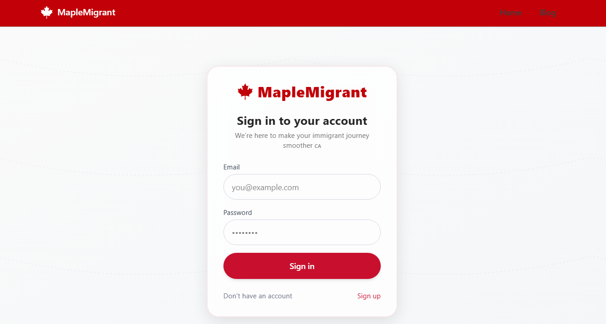

# 🍁 MapleMigrant – Your Canadian Immigration Companion  
*A modern, community‑driven blogging platform built with React, Tailwind CSS, Hono, and Prisma.*


> **Mission:** Empower newcomers, immigrants, international students, and expats with real stories, expert guidance, and a welcoming Canadian community.

---

## ✨ What Makes MapleMigrant Stand Out
| Area / Goal           | Solution & Impact                                                                                 |
| --------------------- | -------------------------------------------------------------------------------------------------- |
|**Real‑world domain, real constraints**  | Built to serve immigrants who rely on fast, reliable information.                |
| **Blazing‑fast API**  | Runs on Cloudflare Workers (edge), so requests hit the nearest PoP. Typical response < **30 ms**.  |
| **Type‑safety**       | One shared Zod schema → Prisma types → React hooks. <br>Zero `any`, fewer runtime bugs.            |
| **Secure Auth**       | JWT (HS256) + bcrypt. Login endpoint rate‑limited to block brute‑force.                            |
| **maplemigrant-common** | Published Zod schema package (npm) used by both API and React hooks.                             |
| **Skeleton Loading** | Instant “shimmer” placeholders while data fetches, so pages feel faster.                            |
| **CI / CD**           | GitHub Actions lint + tests + type‑check, then Vercel preview URLs on every pull request.          |
| **Accessible UI**     | WCAG‑AA colour contrast, keyboard‑friendly, screen‑reader labels. Lighthouse a11y **95+**.         |

---

## 🛠️ Tech Stack
| Layer            | Stack                                                                                                      |
| ---------------- | ---------------------------------------------------------------------------------------------------------- |
| **Frontend**     | React.js · TypeScript · Tailwind CSS · shadcn/ui                                                    |
| **Backend**      | [Hono](https://hono.dev/) (Cloudflare Workers) · JWT Auth                                                  |
| **Common** | Zod schema package &nbsp; [](https://www.npmjs.com/package/maplemigrant-common) |
| **Database**     | PostgreSQL (via Aiven) · Prisma ORM                                                                         |

---

## 📸 Gallery
| Landing Page | Blog Feed | Single Post | Create Post | Authentication |
| ------------ | --------- | ----------- | ----------- | -------------- |
|  |  |  |  |   |


---

## 🚀 Quick Start

```bash
# 1. Clone
git clone https://github.com/Pranav-Talwar/MapleMigrant.git && cd MapleMigrant

# 2. Install deps
pnpm install

# 3. Set environment variables
cp .env.example .env
#   - DATABASE_URL=...
#   - JWT_SECRET=...

# 4. Dev mode (frontend + backend in one command)
pnpm dev
